# ARMA Audit Engine — System Architecture

> Visual data flow reference. Every diagram uses color-coded boxes:
> **Blue** = Google APIs · **Orange** = DataForSEO · **Purple** = Claude AI · **Green** = Internal/Puppeteer · **Yellow** = Output · **Grey** = Database

---

## Diagram 1 — System Overview

Two REST endpoints. Lite runs first and saves the competitor to the database.
Full reads that saved data to guarantee both reports always reference the exact same competitor.

```mermaid
%%{init: {"theme": "base", "themeVariables": {"fontSize": "14px", "lineColor": "#64748B", "clusterBkg": "#F8FAFC", "edgeLabelBackground": "#fff"}}}%%
flowchart LR
    classDef google fill:#DBEAFE,color:#1D4ED8,stroke:#93C5FD,stroke-width:2px
    classDef dfs    fill:#FFEDD5,color:#C2530A,stroke:#FED7AA,stroke-width:2px
    classDef ai     fill:#EDE9FE,color:#6D28D9,stroke:#DDD6FE,stroke-width:2px
    classDef sys    fill:#D1FAE5,color:#065F46,stroke:#6EE7B7,stroke-width:2px
    classDef out    fill:#FEF3C7,color:#92400E,stroke:#FCD34D,stroke-width:2px
    classDef inp    fill:#1E293B,color:#F1F5F9,stroke:#475569,stroke-width:2px
    classDef db     fill:#F1F5F9,color:#475569,stroke:#94A3B8,stroke-width:2px

    IN1[/"POST /lite-report\nurl · city · state · vertical"/]:::inp

    subgraph LITE["  Lite Checker — ~38 sec per lead  "]
        direction TB
        LA["Google Places API\nname · rating · reviews · phone"]:::google
        LB["DataForSEO SERP Maps\nexact Google Maps ranking\n+ competitor auto-selected"]:::dfs
        LC["DataForSEO Reviews + Posts\nreply rate · snippets · GBP activity"]:::dfs
        LD["Claude Haiku × 3\nowner · service area · cold email"]:::ai
        LE["Revenue Calculator\n26-vertical benchmark × traffic"]:::sys
        LP[/"Lite PDF or JSON\nlead + competitor + gap"/]:::out
        LA --> LB --> LC --> LD --> LE --> LP
    end

    DB[("SQLite DB\ncompetitor\nlocked")]:::db

    subgraph FULL["  Full Checker — 1–2 min per lead  "]
        direction TB
        FA["Google PageSpeed × 4\nlead mobile · lead desktop\ncomp mobile · comp desktop"]:::google
        FB["Puppeteer Crawl × 2\nscreenshots + 11 feature booleans\nlead site then competitor"]:::sys
        FC["Claude Sonnet\nall data + screenshots\nfull analysis + fixes"]:::ai
        FP[/"6-Page Audit PDF\nCover · Rankings · Website\nReviews · Issues · CTA"/]:::out
        FA --> FB --> FC --> FP
    end

    IN2[/"POST /full-report\nurl — runs after Lite"/]:::inp

    IN1 -->|"1. sends lead URL + location"| LA
    LE -->|"saves lead + competitor"| DB
    IN2 -->|"2. sends URL only"| DB
    DB -->|"reads saved competitor\nname · place_id · position"| FA
```



---

## Diagram 2 — Lite Checker: Parallel Execution Timeline

Shows what runs concurrently vs sequentially — this is why the total is ~38 seconds.
The DataForSEO Reviews async task (15–20s poll cycle) sets the duration of Batch 2.

```mermaid
%%{init: {"theme": "base", "themeVariables": {"fontSize": "14px", "lineColor": "#64748B", "clusterBkg": "#F8FAFC"}}}%%
flowchart TD
    classDef google fill:#DBEAFE,color:#1D4ED8,stroke:#93C5FD,stroke-width:2px
    classDef dfs    fill:#FFEDD5,color:#C2530A,stroke:#FED7AA,stroke-width:2px
    classDef ai     fill:#EDE9FE,color:#6D28D9,stroke:#DDD6FE,stroke-width:2px
    classDef sys    fill:#D1FAE5,color:#065F46,stroke:#6EE7B7,stroke-width:2px
    classDef out    fill:#FEF3C7,color:#92400E,stroke:#FCD34D,stroke-width:2px
    classDef inp    fill:#1E293B,color:#F1F5F9,stroke:#475569,stroke-width:2px
    classDef db     fill:#F1F5F9,color:#475569,stroke:#94A3B8,stroke-width:2px

    START[/"POST /lite-report received"/]:::inp

    subgraph P1["⚡ Parallel Batch 1 — ~3 sec"]
        direction LR
        A1["Google Places Text Search\nname · rating · reviews · place_id · phone"]:::google
        A2["DataForSEO Domain Rank\nmonthly traffic estimate"]:::dfs
    end

    subgraph SEQ["Sequential — Map Pack Rankings — ~10 sec · 24h cached"]
        direction LR
        B1["DataForSEO SERP Maps  PRIMARY\nexact Google Maps ranking\nall businesses in city by rank"]:::dfs
        B2["Google Places  FALLBACK\nonly if DataForSEO down\nprominence order ≈ ranking"]:::google
        B3["Competitor Selection\nLead #2–4 → vs #1\nLead #5–8 → vs #3\nLead #9+ → vs #4–5"]:::sys
        B1 -->|"primary"| B3
        B2 -. "fallback only" .-> B3
    end

    subgraph P2["⚡ Parallel Batch 2 — ~20 sec  (6 calls fire at the same time)"]
        direction LR
        C1["DataForSEO Reviews\ntask_post → poll 5s → task_get\n100 reviews · reply status\n← slowest call, sets batch time"]:::dfs
        C2["DataForSEO GBP Posts\nposts last 28 days\n→ posts per week"]:::dfs
        C3["Lead Homepage\nHTTP fetch + HTML strip\nvisible page text"]:::sys
        C4["Google Places Details\ncompetitor place_id\n→ phone number"]:::google
        C5["Competitor Homepage\nHTTP fetch + strip"]:::sys
        C6["DataForSEO SERP Organic\nnon-map Google ranking\ntop-10 organic results"]:::dfs
    end

    subgraph P3["⚡ Parallel Batch 3 — ~5 sec  (3 Claude Haiku calls)"]
        direction LR
        D1["Claude Haiku\nLead page text\n→ owner name\n→ service area"]:::ai
        D2["Claude Haiku\nComp page text\n→ owner name\n→ service area"]:::ai
        D3["Claude Haiku\nAll audit data\n→ cold email subject\n→ 3-sentence body"]:::ai
    end

    CALC["Revenue Calculation — instant\ntraffic × CVR% × avg ticket = current\npotential − current = monthly gap"]:::sys
    SAVE[("Save to SQLite\nlead + competitor fields\nFull Checker reads here")]:::db

    subgraph OUT["Output"]
        direction LR
        OPDF[/"Binary PDF\nARMA_LiteCheck_domain.pdf"/]:::out
        OJSN[/"Structured JSON\n?format=json — 25+ fields"/]:::out
    end

    START --> P1
    P1 -->|"place_id + traffic confirmed"| SEQ
    SEQ -->|"lead position + competitor locked"| P2
    P2 -->|"page text + review data ready"| P3
    P3 --> CALC --> SAVE --> OUT
```



---

## Diagram 3 — Lite Checker: Full API & Data Flow

Every API call in detail, with the exact data fields flowing between each step.

```mermaid
%%{init: {"theme": "base", "themeVariables": {"fontSize": "13px", "lineColor": "#64748B", "clusterBkg": "#F8FAFC"}}}%%
flowchart TD
    classDef google fill:#DBEAFE,color:#1D4ED8,stroke:#93C5FD,stroke-width:2px
    classDef dfs    fill:#FFEDD5,color:#C2530A,stroke:#FED7AA,stroke-width:2px
    classDef ai     fill:#EDE9FE,color:#6D28D9,stroke:#DDD6FE,stroke-width:2px
    classDef sys    fill:#D1FAE5,color:#065F46,stroke:#6EE7B7,stroke-width:2px
    classDef out    fill:#FEF3C7,color:#92400E,stroke:#FCD34D,stroke-width:2px
    classDef inp    fill:#1E293B,color:#F1F5F9,stroke:#475569,stroke-width:2px
    classDef db     fill:#F1F5F9,color:#475569,stroke:#94A3B8,stroke-width:2px

    IN[/"POST /lite-report — url · city · state · vertical"/]:::inp

    subgraph S1["Step 1 — Parallel"]
        direction LR
        GBP["Google Places Text Search\nQuery: domain + city + state\nVerifies by matching website field to domain\nReturns: real_name · rating · review_count\nplace_id · phone · address · gbp_city · gbp_state"]:::google
        TRF["DataForSEO Labs Domain Rank\nTarget: lead domain\nReturns: estimated monthly traffic\nFallback: 200 visits if API returns 0"]:::dfs
    end

    subgraph S2["Step 2 — Map Pack Rankings — 3 buyer-intent keywords searched"]
        PRI["DataForSEO SERP Maps  PRIMARY\nQuery: 'hvac in Toledo' × 3 keyword variants\nReturns: rank_group · title · rating\nvotes_count · place_id for all businesses\nCached 24 hours per keyword + city + state"]:::dfs
        FAL["Google Places Text Search  FALLBACK\nOnly used when DataForSEO unavailable\nGeocoded to city center 20km radius\nProminence order ≈ map ranking"]:::google
        SEL["Competitor Selection Logic\nLead #1 → compare to #2\nLead #2–4 → compare to #1\nLead #5–8 → compare to #3\nLead #9–13 → compare to #4\nReturns: fullPack top-5 · competitor object"]:::sys
        PRI -->|"ranked results"| SEL
        FAL -. "fallback" .-> SEL
    end

    subgraph S3["Step 3 — Parallel Enrichment — 6 calls fire simultaneously"]
        direction LR
        REV["DataForSEO Reviews\ntask_post → poll 5s → task_get\ndepth: 100 reviews sorted newest\nFields: review_text · rating · owner_answer\nOutputs: reply_rate · unanswered_count\nreview snippets passed to Claude"]:::dfs
        PST["DataForSEO GBP Posts\nmy_business_posts live/advanced\nCounts posts last 28 days\n→ posts_per_week"]:::dfs
        LTX["Lead Homepage Fetch\nHTTP GET → strip HTML tags\nReturns: visible page text\n~3000 chars passed to Claude"]:::sys
        CPH["Google Places Details\ncompetitor place_id\nField: formatted_phone_number"]:::google
        CTX["Competitor Homepage Fetch\nSame HTTP fetch + strip\nPassed to Claude Haiku"]:::sys
        ORG["DataForSEO SERP Organic\nlive/advanced endpoint\nQuery: primary keyword in city\nReturns: organic position top-10"]:::dfs
    end

    subgraph S4["Step 4 — Claude Haiku × 3 in parallel"]
        direction LR
        HL["Claude Haiku\nInput: lead page text\nExtracts: owner name\nExtracts: service area cities"]:::ai
        HC["Claude Haiku\nInput: competitor page text\nExtracts: owner name\nExtracts: service area cities"]:::ai
        HE["Claude Haiku\nInput: position · reviews · revenue gap\nOutputs: subject line\n+ 3-sentence cold email body"]:::ai
    end

    BM["Industry Benchmarks × Traffic\n26 verticals with CVR% and avg ticket\ncurrent = traffic × CVR × ticket\nmonthly_loss = potential − current  cap $60k"]:::sys

    DB[("SQLite — leads table\nSaves: domain · name · city · state · vertical\nlead GBP data · map position · place_id\ncompetitor name · domain · place_id\ncompetitor rating · reviews · position\nFull Checker reads competitor fields from here")]:::db

    subgraph OUT["Output"]
        direction LR
        PDF[/"Binary PDF\nARMA_LiteCheck_domain.pdf"/]:::out
        JSN[/"Structured JSON\n?format=json — 25+ fields"/]:::out
    end

    IN --> S1
    S1 -->|"place_id · name · traffic"| S2
    S2 -->|"lead_position · competitor · fullPack"| S3
    S3 -->|"review_data · page_text · organic_pos"| S4
    S4 -->|"owner · service_area · cold_email"| BM
    BM -->|"revenue gap"| DB
    DB -->|"HTML → Puppeteer"| OUT
```



---

## Diagram 4 — Full Checker: Full API & Data Flow

Runs after Lite. Competitor is fixed from the database — no re-selection. Adds speed scores,
website crawl with screenshots, and Claude Sonnet analysis that visually verifies screenshots
before writing any fix recommendations.

```mermaid
%%{init: {"theme": "base", "themeVariables": {"fontSize": "13px", "lineColor": "#64748B", "clusterBkg": "#F8FAFC"}}}%%
flowchart TD
    classDef google fill:#DBEAFE,color:#1D4ED8,stroke:#93C5FD,stroke-width:2px
    classDef dfs    fill:#FFEDD5,color:#C2530A,stroke:#FED7AA,stroke-width:2px
    classDef ai     fill:#EDE9FE,color:#6D28D9,stroke:#DDD6FE,stroke-width:2px
    classDef sys    fill:#D1FAE5,color:#065F46,stroke:#6EE7B7,stroke-width:2px
    classDef out    fill:#FEF3C7,color:#92400E,stroke:#FCD34D,stroke-width:2px
    classDef inp    fill:#1E293B,color:#F1F5F9,stroke:#475569,stroke-width:2px
    classDef db     fill:#F1F5F9,color:#475569,stroke:#94A3B8,stroke-width:2px
    classDef page   fill:#FCE7F3,color:#9D174D,stroke:#F9A8D4,stroke-width:2px

    IN[/"POST /full-report — url"/]:::inp

    DB[("SQLite — reads Lite row\ncompetitor_name · competitor_domain · competitor_place_id\ncompetitor_position · lead_map_position\ncity · state · vertical · traffic_monthly\nfullPack JSON from lite_report_data")]:::db

    subgraph S1["Step 1 — Parallel — 7 API calls fire simultaneously"]
        direction LR
        PS1["PageSpeed API\nLead MOBILE\nscore · LCP\nCLS · INP · TTFB\n24h cached"]:::google
        PS2["PageSpeed API\nLead DESKTOP\nscore · LCP · CLS\n24h cached"]:::google
        PS3["PageSpeed API\nComp MOBILE\nscore · LCP\n24h cached"]:::google
        PS4["PageSpeed API\nComp DESKTOP\nscore · LCP\n24h cached"]:::google
        KWD["DataForSEO Keywords\nGoogle Ads Search Volume\nQuery: 'hvac Toledo'\nReturns: monthly volume\n÷ 30 = daily searches"]:::dfs
        RV2["DataForSEO Reviews\ntask_post → poll → get\nreply_rate · unanswered\nreview snippets"]:::dfs
        PT2["DataForSEO GBP Posts\nposts per week\nlast 28 days"]:::dfs
    end

    subgraph S2["Step 2 — Sequential Crawls — Puppeteer Headless Chrome"]
        CRL["Crawl Lead Site\nViewport 390px → mobile JPEG screenshot\nViewport 1280px → desktop JPEG screenshot\n11 booleans detected from DOM + rendered HTML:\nhasPhoneAboveFoldMobile · hasStickyCTA · hasAboveFoldCTA\nhasReviewsOnHome · hasTrustBadges · hasServiceAreaPages\nhasBookingForm · hasEmergencyMessaging · hasFinancing\nhasDomainMismatch + pageText + page title"]:::sys
        CRC["Crawl Competitor Site\nSame 11 booleans — no screenshots\nUsed for side-by-side comparison table\non Page 3 of the report"]:::sys
        CRL -->|"lead booleans + screenshots"| CRC
    end

    subgraph S3["Step 3 — Claude Sonnet Analysis"]
        CSN["Claude Sonnet receives ALL of the above:\nPageSpeed scores · crawl booleans · mobile + desktop screenshots\nReview snippets · reply rate · GBP post frequency\nPre-computed revenue math · daily search volume · full map pack\n\nScreenshots are ground truth:\nIf phone visible in screenshot → overrides DOM boolean\n\nOutputs structured JSON:\nParadox headline · 4 cover numbers\nPage 2: gap analysis + 3 GBP fixes with % impact\nPage 3: 7-row comparison table + 3 website fixes\nPage 5: 2 additional issues with dollar impact each"]:::ai
    end

    subgraph S4["Output — 6-Page PDF  (HTML → Puppeteer → Binary PDF)"]
        direction LR
        PG1[/"Cover\nParadox headline\n4 key numbers"/]:::page
        PG2[/"Page 2\nMap rank gap\n3 GBP fixes"/]:::page
        PG3[/"Page 3\nWebsite audit\nSpeed table + 3 fixes"/]:::page
        PG4[/"Page 4\nReview analysis\nReply rate"/]:::page
        PG5[/"Page 5\n2 issues\n+ dollar impact"/]:::page
        PG6[/"Page 6\nNext steps\nCTA"/]:::page
    end

    IN -->|"domain extracted"| DB
    DB -->|"competitor + lead data loaded"| S1
    S1 -->|"speed scores + daily searches"| S2
    S2 -->|"booleans + screenshots + comp booleans"| S3
    S3 -->|"structured JSON analysis"| S4
```



---

## Diagram 5 — Report Output Structure

What is inside each PDF. Every field is sourced from a real API call — no generated copy.

```mermaid
%%{init: {"theme": "base", "themeVariables": {"fontSize": "13px", "lineColor": "#64748B", "clusterBkg": "#F8FAFC"}}}%%
flowchart LR
    classDef google fill:#DBEAFE,color:#1D4ED8,stroke:#93C5FD,stroke-width:2px
    classDef dfs    fill:#FFEDD5,color:#C2530A,stroke:#FED7AA,stroke-width:2px
    classDef ai     fill:#EDE9FE,color:#6D28D9,stroke:#DDD6FE,stroke-width:2px
    classDef sys    fill:#D1FAE5,color:#065F46,stroke:#6EE7B7,stroke-width:2px
    classDef out    fill:#FEF3C7,color:#92400E,stroke:#FCD34D,stroke-width:2px
    classDef page   fill:#FCE7F3,color:#9D174D,stroke:#F9A8D4,stroke-width:2px

    subgraph LOUT["  Lite Checker Output — 1-Page Quick Audit Brief  "]
        direction TB
        L0[/"PDF or JSON — ARMA_LiteCheck_domain.pdf"/]:::out
        L1["Business Profile\nreal name · GBP rating · review count\nmap position · organic position\nphone · address · owner name\nsource: Google Places API"]:::google
        L2["Competitor Profile\nname · map position · rating · reviews\nphone · website · owner · service area\nsource: DataForSEO Maps + Google Places"]:::dfs
        L3["Revenue Gap Estimate\nmonthly loss: $X,XXX\nlow: $X,XXX  ·  high: $X,XXX\nsource: 26-vertical benchmark × traffic"]:::sys
        L4["Review Intelligence\nreply rate: XX%  ·  unanswered: N\n3 review snippets with reply status\nsource: DataForSEO Reviews"]:::dfs
        L5["Cold Email — Ready to Send\nsubject line + 3-sentence body\npersonalised with real positions + dollar gap\nsource: Claude Haiku"]:::ai
        L0 --> L1 --> L2 --> L3 --> L4 --> L5
    end

    subgraph FOUT["  Full Checker Output — 6-Page Deep Audit Report  "]
        direction TB
        F0[/"PDF — ARMA_Audit_domain.pdf"/]:::out
        P1["Cover Page\nParadox headline e.g. 'Better Rated. Still Losing.'\n4 numbers: position · reviews · revenue gap · fixes\nsource: live API data via Claude Sonnet"]:::page
        P2["Page 2 — Map Pack Gap\nLead vs competitor positions\nRevenue gap in dollars per month\n3 specific GBP fixes with impact % each\nsource: DataForSEO Maps + benchmarks"]:::page
        P3["Page 3 — Website Audit\n7-row comparison table: lead vs competitor\nMobile speed · LCP · phone · CTA\nreviews · trust badges · booking form\n3 specific website fixes\nsource: PageSpeed API + Puppeteer crawl"]:::page
        P4["Page 4 — Review Analysis\nGBP reply rate with real counts\nRecent snippets with owner reply status\nGBP post frequency per week\nsource: DataForSEO Reviews + Posts"]:::page
        P5["Page 5 — Additional Issues\n2 more gaps not on pages 2–3\nEach with specific dollar impact range\nFrom: crawl booleans\ne.g. no service pages · no booking form"]:::page
        P6["Page 6 — Next Steps\nCall to action for full engagement"]:::page
        F0 --> P1 --> P2 --> P3 --> P4 --> P5 --> P6
    end
```



---

## Data Sources Summary

| Data Point | API / Source | Cached |
|---|---|---|
| Business name, GBP rating, reviews, phone | Google Places Text Search + Details | No |
| Google Maps ranking (primary) | DataForSEO SERP Maps live/advanced | 24h SQLite |
| Google Maps ranking (fallback) | Google Places Text Search | 24h SQLite |
| Organic search position | DataForSEO SERP Organic | No |
| Monthly traffic estimate | DataForSEO Labs Domain Rank | No |
| Review text + owner reply status | DataForSEO Business Data Reviews (async task) | No |
| GBP posts per week | DataForSEO Business Data GBP Posts | No |
| Daily search volume | DataForSEO Keywords Google Ads | No |
| PageSpeed score + LCP/CLS/INP/TTFB | Google PageSpeed Insights API v5 | 24h SQLite |
| Website feature detection (11 booleans) | Puppeteer headless Chrome crawl | No |
| Mobile + desktop screenshots | Puppeteer 390px + 1280px viewport | No |
| Owner name + service area | Claude Haiku (from homepage text) | No |
| Cold email draft | Claude Haiku (from all audit data) | No |
| Full report analysis + 6 fix sets | Claude Sonnet (with screenshots) | No |
| Revenue gap estimate | Internal — 26-vertical benchmark table | n/a |
| Competitor selection | Internal — position-based logic | n/a |

## API Endpoints

```
POST /lite-report   { url, city, state, vertical? }   → PDF or JSON (?format=json)
POST /full-report   { url }                            → 6-page PDF
```

**Timing:** Lite ~38 sec per lead · Full 1–2 min per lead · 200 leads ≈ 3–4 hrs sequential
