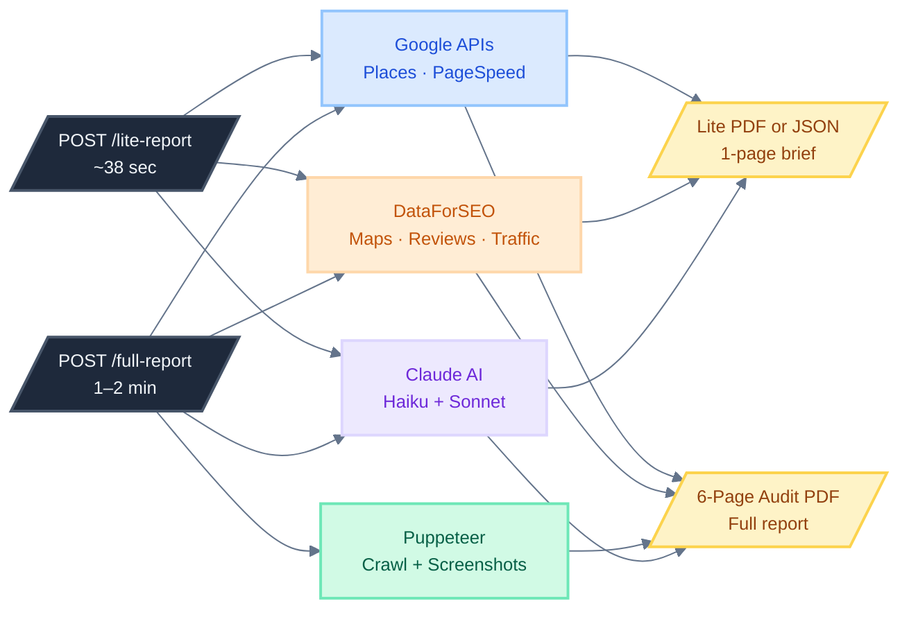

# ARMA Audit Engine — Documentation

## Documents

| File | What it covers |
|---|---|
| [ARCHITECTURE.md](./ARCHITECTURE.md) | **5 Mermaid diagrams** — system overview, execution timeline, Lite flow, Full flow, output structure |
| [system-overview.md](./system-overview.md) | System overview + Lite + Full diagrams with prose explanation |
| [lite-checker.md](./lite-checker.md) | Lite Checker flow + competitor selection logic + JSON field reference |
| [full-checker.md](./full-checker.md) | Full Checker flow + 11 crawl booleans + Claude screenshot logic |
| [api-reference.md](./api-reference.md) | Endpoints · request/response format · code examples · timing |

## Key Facts

| | |
|---|---|
| Trigger | HTTP REST API — `POST /lite-report` or `POST /full-report` |
| Input | `url` + `city` + `state` (+ optional `vertical`) |
| Output | PDF binary in response, or JSON with `?format=json` |
| Lite time | **~38 sec** per lead (verified) |
| Full time | **1–2 min** per lead |
| Competitor data | Yes — name · position · rating · reviews · phone · domain |
| Data sources | Google Places · DataForSEO · Google PageSpeed · Claude AI · Puppeteer |
