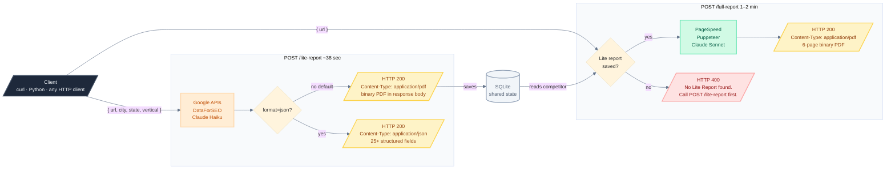
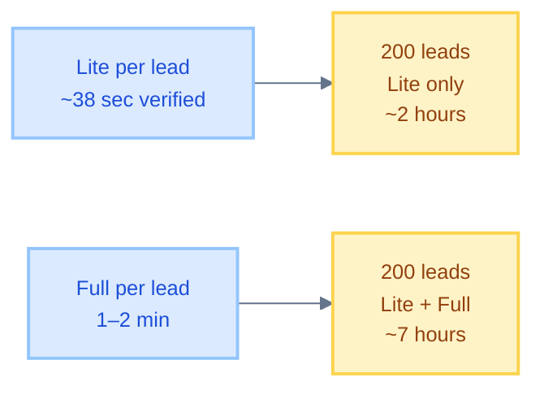

# API Reference

Base URL: `http://localhost:3002` (or your deployed host)

---

## Request → Response Flow



---

## POST /lite-report

### Request

```http
POST /lite-report
Content-Type: application/json

{
  "url":      "https://acmeplumbing.com",
  "city":     "Dallas",
  "state":    "TX",
  "vertical": "Plumbing",
  "format":   "json"
}
```

| Field | Required | Description |
|---|---|---|
| `url` | Yes | Lead website URL |
| `city` | Yes | City name |
| `state` | Yes | State name or 2-letter code |
| `vertical` | No | Industry niche — auto-detected if omitted |
| `format` | No | Set to `"json"` to return JSON instead of PDF |

**Supported verticals:** Plumbing · HVAC · Electrical · Roofing Replacement · Pest Control · Tree Service · Painting · Flooring · Concrete · Siding · Foundation Repair · Drywall · Junk Removal / Demolition · Garage Door Repair / Install · Window & Door Replacement · Fences & Decks · Handyman · Carpet Installation · Kitchen Remodeling · Bathroom Remodeling · Window Cleaning · Solar Installation · Pool Installation · Insulation · Fire & Water Damage Restoration · Garage Conversion / ADU

### Response — PDF (default)

```http
HTTP 200 OK
Content-Type: application/pdf
Content-Disposition: attachment; filename="ARMA_LiteCheck_acmeplumbing.com.pdf"

[binary PDF]
```

### Response — JSON (`?format=json`)

```json
{
  "domain": "acmeplumbing.com",
  "city": "Dallas",
  "state": "TX",
  "vertical": "Plumbing",
  "lead": {
    "name": "Acme Plumbing Co.",
    "rating": 4.7,
    "review_count": 134,
    "position": 5,
    "organic_position": 8,
    "phone": "(214) 555-0100",
    "address": "123 Main St, Dallas, TX 75201",
    "owner": "John Smith",
    "service_area": "Dallas, Plano, Frisco"
  },
  "competitor": {
    "name": "Dallas Pro Plumbing",
    "position": 3,
    "rating": 4.9,
    "review_count": 312,
    "domain": "dallasproplumbing.com",
    "phone": "(214) 555-0200",
    "owner": "Mike Johnson",
    "service_area": "Dallas, Irving, Garland"
  },
  "fullPack": [ "...top 5 map pack businesses..." ],
  "traffic_monthly": 420,
  "revenue": {
    "monthly_loss": 9072,
    "loss_low_usd": 6350,
    "loss_high_usd": 11793,
    "current_revenue": 15876,
    "potential_revenue": 24948
  },
  "review_insights": {
    "replyRate": 0.23,
    "repliedCount": 7,
    "unansweredCount": 23,
    "totalChecked": 30,
    "snippets": ["...3 review excerpts with reply status..."]
  },
  "cold_email": {
    "subject": "Acme Plumbing — #5 on Google Maps while Dallas Pro holds #3",
    "body": "..."
  }
}
```

### Error Responses

```http
HTTP 400  { "error": "url, city, state required" }
HTTP 502  { "error": "Could not fetch map pack rankings...", "keywords_tried": [...] }
```

---

## POST /full-report

### Request

```http
POST /full-report
Content-Type: application/json

{ "url": "https://acmeplumbing.com" }
```

Must match a domain that has a saved Lite Report. Always returns PDF.

### Response

```http
HTTP 200 OK
Content-Type: application/pdf
Content-Disposition: attachment; filename="ARMA_Audit_acmeplumbing.com.pdf"

[binary 6-page PDF]
```

### Error Responses

```http
HTTP 400  { "error": "url required" }
HTTP 400  { "error": "No Lite Report found. Call POST /lite-report first." }
```

---

## Timing & Throughput



| Scenario | Time |
|---|---|
| Lite Checker per lead | **~38 sec** (verified) |
| Full Checker per lead | 1–2 min |
| 200 leads — Lite only | ~2 hours sequential |
| 200 leads — Lite + Full | ~7 hours sequential |

> No built-in queue. Requests are processed one at a time. For high-volume batch processing, wrap in an external job queue.

---

## Caching

| Cache | TTL | Storage |
|---|---|---|
| Map pack results | 24 hours | `mappack_cache` SQLite table |
| PageSpeed scores | 24 hours | `pagespeed_cache` SQLite table |
| Lead/competitor data | Permanent until overwritten | `leads` SQLite table |

---

## Code Examples

```bash
# Lite — save PDF
curl -X POST http://localhost:3002/lite-report \
  -H "Content-Type: application/json" \
  -d '{"url":"https://acmeplumbing.com","city":"Dallas","state":"TX","vertical":"Plumbing"}' \
  --output lite_report.pdf

# Lite — get JSON (for automation / Claude parsing)
curl -X POST "http://localhost:3002/lite-report?format=json" \
  -H "Content-Type: application/json" \
  -d '{"url":"https://acmeplumbing.com","city":"Dallas","state":"TX","vertical":"Plumbing"}'

# Full — save PDF (run after Lite for same domain)
curl -X POST http://localhost:3002/full-report \
  -H "Content-Type: application/json" \
  -d '{"url":"https://acmeplumbing.com"}' \
  --output full_report.pdf
```

```python
import requests, time

leads = [
  {"url": "https://example1.com", "city": "Dallas",  "state": "TX", "vertical": "Plumbing"},
  {"url": "https://example2.com", "city": "Houston", "state": "TX", "vertical": "HVAC"},
]

for lead in leads:
    r = requests.post("http://localhost:3002/lite-report", json=lead, timeout=300)
    if r.status_code == 200:
        domain = lead["url"].split("//")[1].split("/")[0]
        open(f"lite_{domain}.pdf", "wb").write(r.content)
    time.sleep(2)
```
