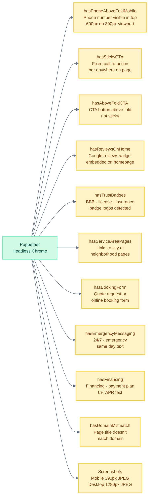
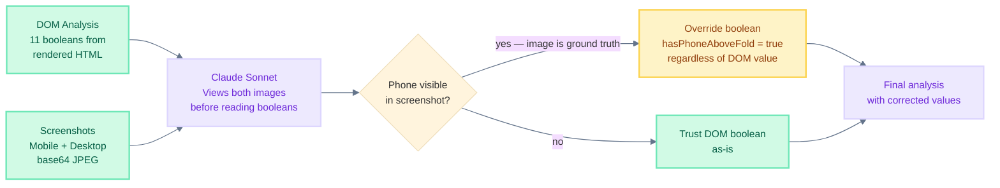
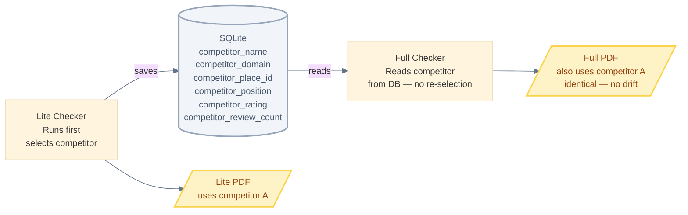

# Full Checker — Detailed Flow

**Endpoint:** `POST /full-report`  
**Prerequisite:** Lite Checker must be run first for the same domain  
**Output:** 6-page PDF  
**Time:** 1–2 minutes per lead

---

## Full Data Flow

```mermaid
%%{init: {"theme": "base", "themeVariables": {"fontSize": "13px", "lineColor": "#64748B", "clusterBkg": "#F8FAFC"}}}%%
flowchart TD
    classDef google fill:#DBEAFE,color:#1D4ED8,stroke:#93C5FD,stroke-width:2px
    classDef dfs    fill:#FFEDD5,color:#C2530A,stroke:#FED7AA,stroke-width:2px
    classDef ai     fill:#EDE9FE,color:#6D28D9,stroke:#DDD6FE,stroke-width:2px
    classDef sys    fill:#D1FAE5,color:#065F46,stroke:#6EE7B7,stroke-width:2px
    classDef out    fill:#FEF3C7,color:#92400E,stroke:#FCD34D,stroke-width:2px
    classDef inp    fill:#1E293B,color:#F1F5F9,stroke:#475569,stroke-width:2px
    classDef db     fill:#F1F5F9,color:#475569,stroke:#94A3B8,stroke-width:2px
    classDef page   fill:#FCE7F3,color:#9D174D,stroke:#F9A8D4,stroke-width:2px

    IN[/"POST /full-report — url"/]:::inp
    DB[("SQLite — reads Lite row\ncompetitor_name · competitor_domain · competitor_place_id\ncompetitor_position · lead_map_position · lead_gbp_place_id\ncity · state · vertical · traffic_monthly · fullPack JSON")]:::db

    subgraph S1["Step 1 — Parallel — 7 calls fire simultaneously  ~25 sec"]
        direction LR
        PS1["PageSpeed API\nLead MOBILE\nscore · LCP\nCLS · INP · TTFB\n24h cached"]:::google
        PS2["PageSpeed API\nLead DESKTOP\nscore · LCP · CLS\n24h cached"]:::google
        PS3["PageSpeed API\nComp MOBILE\nscore · LCP\n24h cached"]:::google
        PS4["PageSpeed API\nComp DESKTOP\nscore · LCP\n24h cached"]:::google
        KWD["DataForSEO Keywords\nGoogle Ads Search Volume\nmonthly volume ÷ 30\n= daily searches in city"]:::dfs
        RV2["DataForSEO Reviews\ntask_post → poll → get\nreply rate · unanswered\nreview snippets"]:::dfs
        PT2["DataForSEO GBP Posts\nposts per week\nlast 28 days"]:::dfs
    end

    subgraph S2["Step 2 — Sequential Website Crawls — Puppeteer Headless Chrome  ~40 sec"]
        CRL["Crawl Lead Site\nViewport 390px → mobile JPEG screenshot\nViewport 1280px → desktop JPEG screenshot\n11 booleans: hasPhoneAboveFoldMobile · hasStickyCTA\nhasAboveFoldCTA · hasReviewsOnHome · hasTrustBadges\nhasServiceAreaPages · hasBookingForm\nhasEmergencyMessaging · hasFinancing\nhasDomainMismatch + pageText + page title"]:::sys
        CRC["Crawl Competitor Site\nSame 11 booleans detected\nNo screenshots taken\nUsed for comparison table on Page 3"]:::sys
        CRL -->|"lead booleans + screenshots ready"| CRC
    end

    subgraph S3["Step 3 — Claude Sonnet Analysis  ~20 sec"]
        CSN["Claude Sonnet receives everything:\nAll PageSpeed scores · all crawl booleans\nMobile + desktop screenshots as base64 JPEG\nReview snippets · reply rate · GBP posts\nPre-computed revenue math · daily searches · full map pack\n\nScreenshots are ground truth:\nIf phone visible in screenshot → overrides DOM boolean\n\nOutputs structured JSON:\nParadox headline · 4 cover numbers\nPage 2: map gap analysis + 3 GBP fixes\nPage 3: 7-row comparison table + 3 website fixes\nPage 5: 2 additional issues with dollar impact"]:::ai
    end

    subgraph S4["Output — 6-Page PDF Report  HTML → Puppeteer → Binary PDF"]
        direction LR
        PG1[/"Cover\nParadox headline\n4 key numbers"/]:::page
        PG2[/"Page 2\nMap rank gap\n3 GBP fixes"/]:::page
        PG3[/"Page 3\nWebsite audit\nspeed comparison"/]:::page
        PG4[/"Page 4\nReview analysis\nreply rate"/]:::page
        PG5[/"Page 5\n2 issues\n+ dollar impact"/]:::page
        PG6[/"Page 6\nNext steps + CTA"/]:::page
    end

    IN -->|"domain extracted from URL"| DB
    DB -->|"competitor + lead fields loaded"| S1
    S1 -->|"speed scores + daily searches"| S2
    S2 -->|"booleans + screenshots + comp booleans"| S3
    S3 -->|"structured JSON analysis"| S4
```



---

## Input

```json
{ "url": "https://acmeplumbing.com" }
```

Must match a domain that already has a Lite Report saved in the database.  
Error if not found: `{ "error": "No Lite Report found. Call POST /lite-report first." }`

---

## What Puppeteer Detects (11 Booleans)



---

## PageSpeed Metrics Explained

| Metric | Good | Needs Work | What It Measures |
|---|---|---|---|
| Score | 90–100 | < 70 | Overall Lighthouse performance |
| LCP | < 2.5s | > 4s | When main content loads |
| CLS | < 0.1 | > 0.25 | Layout shift (things jumping) |
| INP | < 200ms | > 500ms | Response time to user interaction |
| TTFB | < 0.8s | > 1.8s | Server response time |

---

## How Claude Sonnet Uses Screenshots



Claude's instruction: *"Screenshots are ground truth for visible UI — DOM checks miss CSS-injected content and images."*

---

## Competitor Lock — Why It Matters

The Full Checker does **not** re-select a competitor. It reads exactly what the Lite Checker saved:



This guarantees both reports tell the same story about the same competitor.
