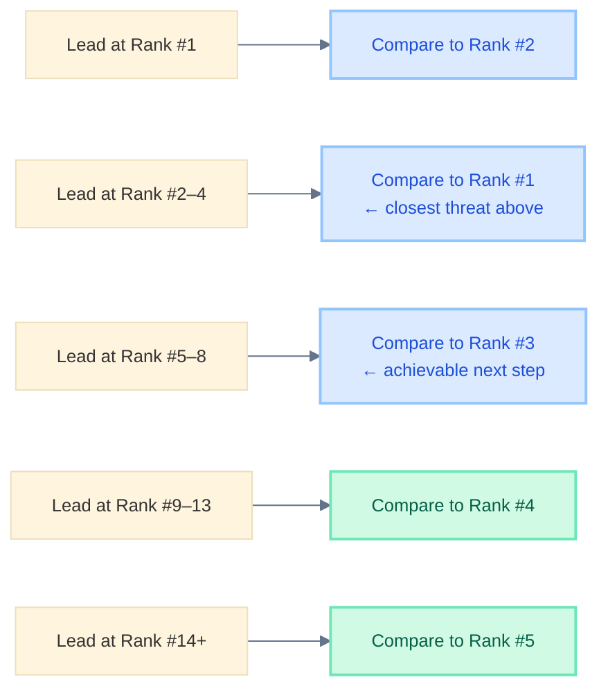

# Lite Checker — Detailed Flow

**Endpoint:** `POST /lite-report`  
**Output:** PDF (default) or JSON (`?format=json`)  
**Time:** ~38 seconds per lead

---

## Full Data Flow

```mermaid
%%{init: {"theme": "base", "themeVariables": {"fontSize": "13px", "lineColor": "#64748B", "clusterBkg": "#F8FAFC"}}}%%
flowchart TD
    classDef google fill:#DBEAFE,color:#1D4ED8,stroke:#93C5FD,stroke-width:2px
    classDef dfs    fill:#FFEDD5,color:#C2530A,stroke:#FED7AA,stroke-width:2px
    classDef ai     fill:#EDE9FE,color:#6D28D9,stroke:#DDD6FE,stroke-width:2px
    classDef sys    fill:#D1FAE5,color:#065F46,stroke:#6EE7B7,stroke-width:2px
    classDef out    fill:#FEF3C7,color:#92400E,stroke:#FCD34D,stroke-width:2px
    classDef inp    fill:#1E293B,color:#F1F5F9,stroke:#475569,stroke-width:2px
    classDef db     fill:#F1F5F9,color:#475569,stroke:#94A3B8,stroke-width:2px

    IN[/"POST /lite-report\nurl · city · state · vertical"/]:::inp

    subgraph S1["Step 1 — Parallel  ~3 sec"]
        direction LR
        GBP["Google Places Text Search\nReturns: real_name · rating · review_count\nplace_id · phone · address · city · state"]:::google
        TRF["DataForSEO Labs Domain Rank\nReturns: monthly traffic estimate\nFallback: 200 if API returns 0"]:::dfs
    end

    subgraph S2["Step 2 — Map Pack Rankings  ~10 sec · 3 keywords searched · 24h cache"]
        PRI["DataForSEO SERP Maps  PRIMARY\nReturns exact Google Maps ranking as\na real user in that city sees it\nAll businesses ranked by rank_group"]:::dfs
        FAL["Google Places  FALLBACK\nOnly used if DataForSEO is unavailable\nGeocoded to city center · 20km radius\nProminence order ≈ map ranking"]:::google
        SEL["Competitor Selection Logic\nLead #1 → vs Rank #2\nLead #2–4 → vs Rank #1\nLead #5–8 → vs Rank #3\nLead #9–13 → vs Rank #4\nReturns: fullPack top-5 + competitor object"]:::sys
        PRI -->|"all ranked businesses"| SEL
        FAL -. "fallback only" .-> SEL
    end

    subgraph S3["Step 3 — Parallel Enrichment  ~20 sec · 6 calls fire at the same time"]
        direction LR
        REV["DataForSEO Reviews\ntask_post → poll 5s → task_get\n100 reviews · owner_answer field\n→ reply_rate · unanswered_count\nSnippets passed to Claude"]:::dfs
        PST["DataForSEO GBP Posts\nPosts last 28 days\n→ posts_per_week"]:::dfs
        LTX["Lead Homepage Fetch\nHTTP GET + HTML strip\n→ visible page text\n~3000 chars to Claude"]:::sys
        CPH["Google Places Details\nCompetitor place_id\n→ formatted_phone_number"]:::google
        CTX["Competitor Homepage Fetch\nHTTP GET + strip\n→ page text to Claude"]:::sys
        ORG["DataForSEO SERP Organic\nNon-map Google ranking\n→ organic position top-10"]:::dfs
    end

    subgraph S4["Step 4 — Claude Haiku × 3 in parallel  ~5 sec"]
        direction LR
        HL["Claude Haiku\nLead page text\n→ owner name\n→ service area cities"]:::ai
        HC["Claude Haiku\nComp page text\n→ owner name\n→ service area cities"]:::ai
        HE["Claude Haiku\nAll audit data\n→ email subject line\n→ 3-sentence cold email"]:::ai
    end

    BM["Industry Benchmarks × Traffic\n26 verticals · CVR% · avg ticket value\ncurrent = traffic × CVR × ticket\nmonthly_loss = potential − current  cap $60k"]:::sys
    DB[("SQLite — leads table\nSaves lead + competitor fields\nFull Checker reads competitor from here")]:::db

    subgraph OUT["Output"]
        direction LR
        PDF[/"Binary PDF\nARMA_LiteCheck_domain.pdf"/]:::out
        JSN[/"Structured JSON\n?format=json — 25+ fields"/]:::out
    end

    IN --> S1
    S1 -->|"place_id · name · traffic"| S2
    S2 -->|"lead_position · competitor · fullPack"| S3
    S3 -->|"page_text · review_data · organic_pos"| S4
    S4 -->|"owner · service_area · cold_email"| BM
    BM -->|"revenue gap"| DB
    DB -->|"HTML → Puppeteer"| OUT
```



---

## Input

```json
{
  "url":      "https://acmeplumbing.com",
  "city":     "Dallas",
  "state":    "TX",
  "vertical": "Plumbing"
}
```

`vertical` is optional — system auto-detects from page content if omitted.

---

## Competitor Selection Logic



---

## JSON Output Fields (all 25+)

Returned when `?format=json` is added. PDF report contains the same data rendered visually.

| Field | Source | Example |
|---|---|---|
| `lead.name` | Google Places | `"Glass City Heating & Air"` |
| `lead.rating` | Google Places | `4.7` |
| `lead.review_count` | Google Places | `360` |
| `lead.position` | DataForSEO SERP Maps | `6` |
| `lead.organic_position` | DataForSEO SERP Organic | `11` |
| `lead.phone` | Google Places Details | `"(419) 470-0178"` |
| `lead.address` | Google Places Details | `"123 Main St, Toledo, OH"` |
| `lead.owner` | Claude Haiku | `"Perry Keel, Gary Keel"` |
| `lead.service_area` | Claude Haiku | `"Toledo, Sylvania, Perrysburg"` |
| `competitor.name` | DataForSEO Maps | `"A-1 Heating & Improvement Co."` |
| `competitor.position` | DataForSEO Maps | `3` |
| `competitor.rating` | DataForSEO Maps | `4.2` |
| `competitor.review_count` | DataForSEO Maps | `227` |
| `competitor.phone` | Google Places Details | `"(419) 555-0200"` |
| `competitor.domain` | Google Places Details | `"a1heating.com"` |
| `competitor.owner` | Claude Haiku | `"Mike Johnson"` |
| `fullPack[]` | DataForSEO Maps | Top-5 businesses with positions |
| `ranking_keywords[]` | DataForSEO Maps | Position per keyword searched |
| `traffic_monthly` | DataForSEO Labs | `420` |
| `revenue.monthly_loss` | Internal benchmarks | `9072` |
| `revenue.current_revenue` | Internal benchmarks | `15876` |
| `review_insights.replyRate` | DataForSEO Reviews | `0.23` |
| `review_insights.unansweredCount` | DataForSEO Reviews | `23` |
| `review_insights.snippets[]` | DataForSEO Reviews | 3 excerpts with reply status |
| `cold_email.subject` | Claude Haiku | `"Glass City — #6 while A-1 holds #3"` |
| `cold_email.body` | Claude Haiku | 3-sentence outreach email |
