# ARMA Audit Engine — System Overview

> Color key: **Blue** = Google APIs · **Orange** = DataForSEO · **Purple** = Claude AI · **Green** = Internal/Puppeteer · **Yellow** = Output · **Grey** = Database

---

## Two Checkers, One Pipeline

```mermaid
%%{init: {"theme": "base", "themeVariables": {"fontSize": "15px", "lineColor": "#64748B", "clusterBkg": "#F8FAFC", "edgeLabelBackground": "#ffffff"}}}%%
flowchart LR
    classDef google fill:#DBEAFE,color:#1D4ED8,stroke:#93C5FD,stroke-width:2px
    classDef dfs    fill:#FFEDD5,color:#C2530A,stroke:#FED7AA,stroke-width:2px
    classDef ai     fill:#EDE9FE,color:#6D28D9,stroke:#DDD6FE,stroke-width:2px
    classDef sys    fill:#D1FAE5,color:#065F46,stroke:#6EE7B7,stroke-width:2px
    classDef out    fill:#FEF3C7,color:#92400E,stroke:#FCD34D,stroke-width:2px
    classDef inp    fill:#1E293B,color:#F1F5F9,stroke:#475569,stroke-width:2px
    classDef db     fill:#F1F5F9,color:#475569,stroke:#94A3B8,stroke-width:2px

    IN1[/"POST /lite-report\nurl · city · state · vertical"/]:::inp

    subgraph LITE["  Lite Checker — ~38 sec per lead  "]
        direction TB
        LA["Google Places API\nname · rating · reviews · phone"]:::google
        LB["DataForSEO SERP Maps\nexact Google Maps ranking\n+ competitor auto-selected"]:::dfs
        LC["DataForSEO Reviews + Posts\nreply rate · snippets · activity"]:::dfs
        LD["Claude Haiku × 3\nowner · service area · cold email"]:::ai
        LE["Revenue Calculator\n26-vertical benchmark × traffic"]:::sys
        LP[/"Lite PDF or JSON\nlead + competitor + gap"/]:::out
        LA --> LB --> LC --> LD --> LE --> LP
    end

    DB[("SQLite DB\ncompetitor\nlocked")]:::db

    subgraph FULL["  Full Checker — 1–2 min per lead  "]
        direction TB
        FA["Google PageSpeed × 4\nlead + comp · mobile + desktop"]:::google
        FB["Puppeteer Crawl × 2\nscreenshots + 11 feature booleans"]:::sys
        FC["Claude Sonnet\nall data + screenshots → full analysis"]:::ai
        FP[/"6-Page Audit PDF\nCover · Rankings · Website\nReviews · Issues · CTA"/]:::out
        FA --> FB --> FC --> FP
    end

    IN2[/"POST /full-report\nurl — runs after Lite"/]:::inp

    IN1 -->|"1. lead URL + location"| LA
    LE -->|"saves lead + competitor"| DB
    IN2 -->|"2. URL only"| DB
    DB -->|"reads saved competitor\nname · place_id · position"| FA
```



---

## Lite Checker — Full Data Flow

```mermaid
%%{init: {"theme": "base", "themeVariables": {"fontSize": "13px", "lineColor": "#64748B", "clusterBkg": "#F8FAFC"}}}%%
flowchart TD
    classDef google fill:#DBEAFE,color:#1D4ED8,stroke:#93C5FD,stroke-width:2px
    classDef dfs    fill:#FFEDD5,color:#C2530A,stroke:#FED7AA,stroke-width:2px
    classDef ai     fill:#EDE9FE,color:#6D28D9,stroke:#DDD6FE,stroke-width:2px
    classDef sys    fill:#D1FAE5,color:#065F46,stroke:#6EE7B7,stroke-width:2px
    classDef out    fill:#FEF3C7,color:#92400E,stroke:#FCD34D,stroke-width:2px
    classDef inp    fill:#1E293B,color:#F1F5F9,stroke:#475569,stroke-width:2px
    classDef db     fill:#F1F5F9,color:#475569,stroke:#94A3B8,stroke-width:2px

    IN[/"POST /lite-report — url · city · state · vertical"/]:::inp

    subgraph S1["Step 1 — Parallel"]
        direction LR
        GBP["Google Places Text Search\nReturns: real_name · rating · review_count\nplace_id · phone · address · city · state"]:::google
        TRF["DataForSEO Labs Domain Rank\nReturns: monthly traffic estimate\nFallback: 200 if API returns 0"]:::dfs
    end

    subgraph S2["Step 2 — Map Pack Rankings — 3 buyer-intent keywords"]
        PRI["DataForSEO SERP Maps  PRIMARY\nReturns exact Google Maps ranking as\na user in that city would see it\ncached 24 hours per keyword + city + state"]:::dfs
        FAL["Google Places  FALLBACK\nOnly if DataForSEO unavailable\nProminence order ≈ ranking"]:::google
        SEL["Competitor Selection Logic\nLead #2–4 → vs Rank #1\nLead #5–8 → vs Rank #3\nLead #9–13 → vs Rank #4\nReturns: fullPack top-5 · competitor"]:::sys
        PRI -->|"ranked results"| SEL
        FAL -. "fallback only" .-> SEL
    end

    subgraph S3["Step 3 — Parallel Enrichment — 6 calls simultaneously"]
        direction LR
        REV["DataForSEO Reviews\ntask_post → poll 5s → task_get\n100 reviews · reply status\n→ reply_rate · unanswered_count"]:::dfs
        PST["DataForSEO GBP Posts\nposts last 28 days\n→ posts_per_week"]:::dfs
        LTX["Lead Homepage Fetch\nHTTP GET + HTML strip\n→ visible page text"]:::sys
        CPH["Google Places Details\ncompetitor place_id\n→ phone number"]:::google
        CTX["Competitor Homepage Fetch\nHTTP GET + strip"]:::sys
        ORG["DataForSEO SERP Organic\nnon-map Google ranking\ntop-10 organic results"]:::dfs
    end

    subgraph S4["Step 4 — Claude Haiku × 3 in parallel"]
        direction LR
        HL["Claude Haiku\nLead page text\n→ owner name\n→ service area"]:::ai
        HC["Claude Haiku\nComp page text\n→ owner name\n→ service area"]:::ai
        HE["Claude Haiku\nAll audit data\n→ cold email subject\n→ 3-sentence body"]:::ai
    end

    BM["Industry Benchmarks × Traffic\n26 verticals · CVR% · avg ticket\nmonthly_loss = potential − current  cap $60k"]:::sys
    DB[("SQLite — leads table\nSaves lead + competitor fields\nFull Checker reads from here")]:::db

    subgraph OUT["Output"]
        direction LR
        PDF[/"Binary PDF — ARMA_LiteCheck_domain.pdf"/]:::out
        JSN[/"Structured JSON — ?format=json — 25+ fields"/]:::out
    end

    IN --> S1
    S1 -->|"place_id · name · traffic"| S2
    S2 -->|"lead_position · competitor · fullPack"| S3
    S3 -->|"page_text · review_data · organic_pos"| S4
    S4 -->|"owner · service_area · cold_email"| BM
    BM -->|"revenue gap calculated"| DB
    DB -->|"HTML → Puppeteer"| OUT
```



---

## Full Checker — Full Data Flow

```mermaid
%%{init: {"theme": "base", "themeVariables": {"fontSize": "13px", "lineColor": "#64748B", "clusterBkg": "#F8FAFC"}}}%%
flowchart TD
    classDef google fill:#DBEAFE,color:#1D4ED8,stroke:#93C5FD,stroke-width:2px
    classDef dfs    fill:#FFEDD5,color:#C2530A,stroke:#FED7AA,stroke-width:2px
    classDef ai     fill:#EDE9FE,color:#6D28D9,stroke:#DDD6FE,stroke-width:2px
    classDef sys    fill:#D1FAE5,color:#065F46,stroke:#6EE7B7,stroke-width:2px
    classDef out    fill:#FEF3C7,color:#92400E,stroke:#FCD34D,stroke-width:2px
    classDef inp    fill:#1E293B,color:#F1F5F9,stroke:#475569,stroke-width:2px
    classDef db     fill:#F1F5F9,color:#475569,stroke:#94A3B8,stroke-width:2px
    classDef page   fill:#FCE7F3,color:#9D174D,stroke:#F9A8D4,stroke-width:2px

    IN[/"POST /full-report — url"/]:::inp
    DB[("SQLite — reads Lite row\ncompetitor · lead · city · state\nvertical · traffic · fullPack")]:::db

    subgraph S1["Step 1 — Parallel — 7 calls simultaneously"]
        direction LR
        PS1["PageSpeed\nLead MOBILE\nscore · LCP\nCLS · INP · TTFB"]:::google
        PS2["PageSpeed\nLead DESKTOP\nscore · LCP · CLS"]:::google
        PS3["PageSpeed\nComp MOBILE\nscore · LCP"]:::google
        PS4["PageSpeed\nComp DESKTOP\nscore · LCP"]:::google
        KWD["DataForSEO Keywords\nGoogle Ads Volume\nmonthly ÷ 30\n= daily searches"]:::dfs
        RV2["DataForSEO Reviews\ntask_post → poll → get\nreply rate · snippets"]:::dfs
        PT2["DataForSEO GBP Posts\nposts per week\nlast 28 days"]:::dfs
    end

    subgraph S2["Step 2 — Sequential Crawls — Puppeteer Headless Chrome"]
        CRL["Crawl Lead Site\nMobile screenshot 390px\nDesktop screenshot 1280px\n11 feature booleans detected:\nphone · CTA · reviews · badges\nbooking · emergency · financing"]:::sys
        CRC["Crawl Competitor Site\nSame 11 booleans\nNo screenshots\nUsed for comparison table"]:::sys
        CRL -->|"lead booleans + screenshots"| CRC
    end

    subgraph S3["Step 3 — Claude Sonnet Analysis"]
        CSN["Claude Sonnet\nInput: speed scores · crawl booleans\nmobile + desktop screenshots\nreview snippets · reply rate\nrevenue math · map pack · daily searches\n\nScreenshots override DOM booleans\nif phone visible in image → phoneAboveFold = true\n\nOutput: paradox headline · 4 cover numbers\nPage 2 analysis + 3 GBP fixes\nPage 3 table + 3 website fixes\nPage 5 — 2 issues with dollar impact"]:::ai
    end

    subgraph S4["Output — 6-Page PDF"]
        direction LR
        PG1[/"Cover\nParadox headline\n4 key numbers"/]:::page
        PG2[/"Page 2\nMap rank gap\n3 GBP fixes"/]:::page
        PG3[/"Page 3\nWebsite audit\nspeed table"/]:::page
        PG4[/"Page 4\nReview analysis\nreply rate"/]:::page
        PG5[/"Page 5\n2 issues\n+ dollar impact"/]:::page
        PG6[/"Page 6\nNext steps + CTA"/]:::page
    end

    IN -->|"domain extracted from URL"| DB
    DB -->|"competitor + lead data loaded"| S1
    S1 -->|"speed scores + search volume"| S2
    S2 -->|"booleans + screenshots"| S3
    S3 -->|"structured JSON"| S4
```



---

## Throughput & Timing

| Step | Time | Note |
|---|---|---|
| GBP lookup (Google Places) | ~3s | Parallel with traffic |
| Traffic estimate (DataForSEO) | ~3s | Parallel with GBP |
| Map pack rankings (DataForSEO) | ~10s | 24h cached |
| Reviews async task (DataForSEO) | ~15–20s | Slowest — sets batch 2 duration |
| GBP posts + homepage fetch | ~5s | Parallel with reviews |
| Claude Haiku × 3 | ~5s | Parallel |
| PDF generation (Puppeteer) | ~5s | Final step |
| **Lite total** | **~38 sec** | **Verified** |
| PageSpeed × 4 + crawls + Sonnet | 1–2 min | Full Checker |
| **200 leads (Lite only)** | **~2 hrs** | Sequential |
| **200 leads (Lite + Full)** | **~7 hrs** | Sequential |

## API Endpoints

```
POST /lite-report   { url, city, state, vertical? }   → PDF  or  JSON (?format=json)
POST /full-report   { url }                            → 6-page PDF
```

**Required API keys:** `GOOGLE_PLACES_API_KEY` · `DATAFORSEO_LOGIN` + `DATAFORSEO_PASSWORD` · `PAGESPEED_API_KEY` (Full only) · `ANTHROPIC_API_KEY`
